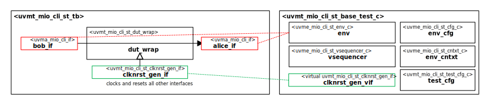

# Datum Technology Corporation Moore.io CLI Testing Grounds Self-Test Bench and UVM Test Library

# About
This package contains the Datum Technology Corporation Moore.io CLI Testing Grounds Self-Test Bench and UVM Test Library.

TODO Describe Moore.io CLI Testing Grounds

# Block Diagram

# Directory Structure
* `bin` - Scripts, metadata and other miscellaneous files
* `docs` - Documents describing the Datum Technology Corporation Moore.io CLI Testing Grounds Self-Test Bench and UVM Test Library
* `examples` - Samples for users
* `src` - Source code for this package

# Dependencies
It is dependent on the following packages:

* `uvm_pkg`
* `uvml_pkg`
* `uvml_logs_pkg`
* `uvml_sb_pkg`
* `uvma_mio_cli_pkg`
* `uvme_mio_cli_st_pkg`
